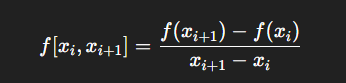
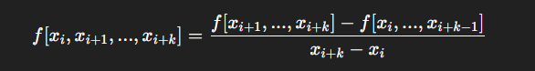
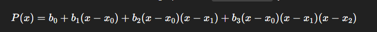

# soalno37_5053241031
anggota:
Jovan Oberto Mishael Sinaga 5053241031
Muhammad Zulfiqar 5053241006
Azmii Maulawiy Said 5053241024
Oktavian Ramadhan 5053241028
Muhammad Khalid Ash-Shiddiq 5053241030

Penjelasan Soal Interpolasi Newton Order 3: 
Pada kode tersebut, Class menerima dua parameter utama x(daftar titik data pada sumbu-x) dan f(x)(daftar titik data pada sumbu-y). Kemudian dibentuk sebuah tabel perbedaan terbagi (divided_diff), dimana kolom pertama diisi langsung dengan nilai fx. Selanjutnya, fungsi _firstOrde, _SecondOrde, dan_ThirdOrde secara bertahap menghitung nilai perbedaan terbagi orde pertama hingga ketiga dengan menggunakan formula:  dan untuk orde lebih tinggi:  

Setelah semua orde dihitung, fungsi Calculate menggunakan formula polinomial Newton orde 3 untuk mencari nilai fungsi pada titik target_x = 11, yaitu:  di mana b0, b1, b2, b3 adalah koefisien polinomial yang berasal dari tabel perbedaan terbagi. Hasil akhirnya dibulatkan ke dua angka di belakang koma dan dicetak sebagai output. 

Dengan data input x = [8, 10, 12, 14] dan f(x) = [660, 1326, 2280, 3570] interpolasi ini memperkirakan nilai fungsi di x = 11 menggunakan pendekatan polinomial derajat tiga. Pendekatan ini dapat digunakan untuk memprediksi nilai fungsi pada suatu titik yang belum diberikan data. 